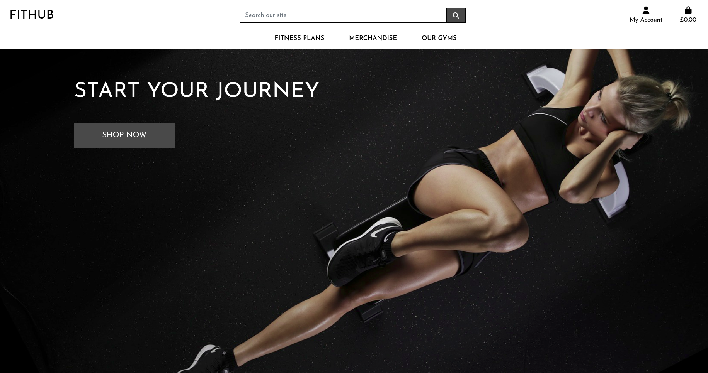
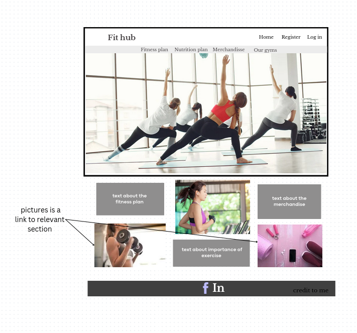
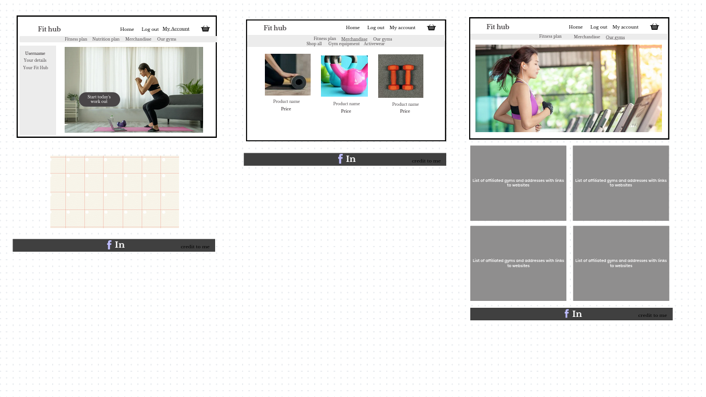
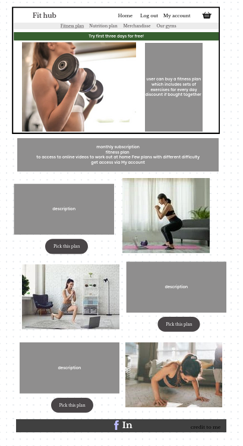
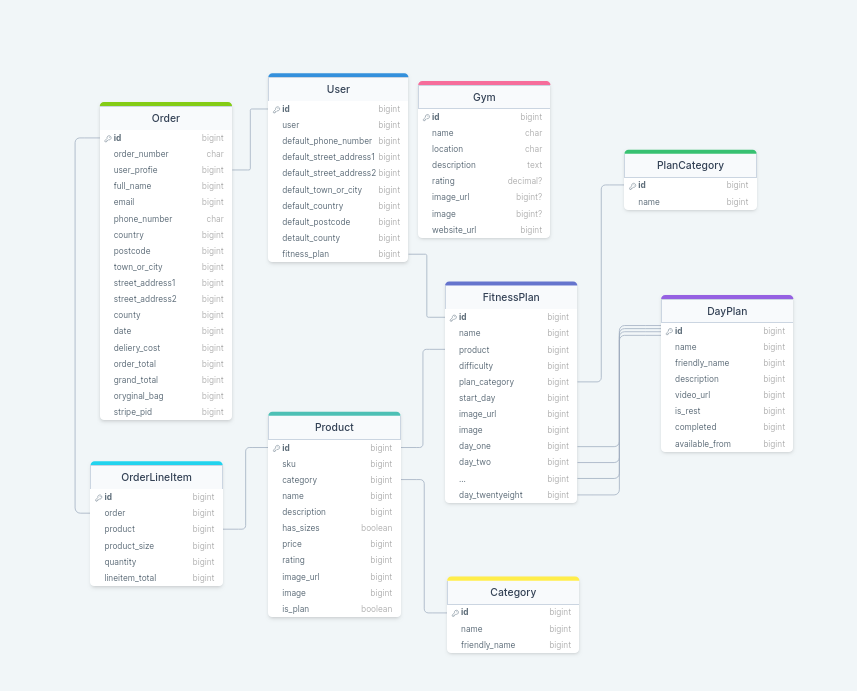

## Code Institute Milestone Project 4

# Fithub

## UI/UX

### Project goals

Fithub is a fictitious website combining e-commerce and fitness.
The goal is to create a brand that is recognisable in all aspects of fitness (merchandise, gyms and 'on demand' fitness plans).
On Fithub page users can but fitness related aparell and equipment as well as fitness plan they can follow. Website also contains a section dedicated to locating Fithub gyms.

### User Stories

As a User I would like to:

- Browse merchandise
- Buy merchandise
- Buy gym equipment
- Create a profile to allow me to check out quicker in the future
- Buy a frtness plan I can follow at home
- Follow fitness plan and mark my progress on the page
- Find a gym I could go to

### Page owner goals

As an owner of this page I would like to:

- be able to add new merchandise to the website
- be able to edit merchandise
- be able to delete metrchandise
- be able to add new fitness plans to the website
- be able to edit fitness plans
- be able to delete fitness plans
- be able to add new gyms to the website
- be able to edit gyms
- be able to delete gyms

### Developer goals

Allow users to easily:

- register to the website
- log in to the website
- navigate through the site
- find items they want to buy
- be able to adjust quantity and sizes of the items
- check out safely
- find a fitness plan that suits them
- follow fitness plan by checking off each completed day
- find nearest gyms they could go to

## Design

### Wireframes

The wireframes for desktop view were developed first then mobile view and responsiveness was being checked while working on the project.
Some aspects of the website are not satisfactory on the mobile view and need to be adjusted(see Bugs section for more details)

### Fonts

Font awesome was used to generate icons.
Google fonts Josefin Sans was used as a basicfont on the page.

## Defensive design

There is a need to add defensive design features.

There are checks in place to make sure users who are not logged in cannot purchase a firness plan.
The same goes for the users who already have a fitness plan saved to their profile.

There is a need for defensive design preventing users accesing fitness plans they have not bought. This is a feature that will be added in the future.

## Features

### Existing features

#### When not logged in

Navigation
Navigation bar consists of a logo which also serves as a link to the main page.
The menu options visible for people who are not logged in consist of Homepage, Log in, Register links.

Registration
Potential users can register their account by providing a unique username and password which is at least 5 characters long.
In case of username being already used (input field is not case sensitive) message is displayed.
If the password is too short, the user is informed about the minimum length.

Logging in
User can log in (this input field is also not case sensitive)
In case of either username not existing or password being incorrect the user receives the same message.

Read
The books and reviews already added are visible regardless of whether the user is logged in or not.
Clicking on the title takes us to a page dedicated to that book where we can see reviews.

Sorting
Books initially display the newest at the top, however, they can also be sorted by number of positive reviews or reverted to sorting newest first by clicking respective buttons on the home page.

#### When logged in

### Information Architecture

Schema:

## Technologies used

- Languages:

- HTML Used to create the structure of websites
- CSS Used to add style to the website
- JavaScript Used to activate dynamic elements
- Python  Used to create and run the web application
- Jinja  Template engine

- Websites

- Am I Responsive - Used to create the mock-up image showing the site
- Coolors Used to create colour palette for the site
- Google Chrome Developer Tools - Used to test the responsiveness of the site
- Firefox Developer Tools - Used to test the responsiveness of the site
- Font Awesome - Used to source icons
- Canva - Used to create wireframes and logo
- Pixabay - Used to source hero image
- Wikipedia - Used to source book cover pictures and book synopsis description
- Github - GitHub for versionn control for the development of application up to deployment
- Gitpod -An online IDE used to build and develop the website
- Heroku- The cloud platform used to host the deployed site
- Slack - Used during development and testing to find the solutions for the encountered problems
- Stack Overflow - Used to search for the answers to encountered problems
- Code Institute - Used to review concepts covered in preceding modules and walk-through projects
- RandomKeyGen - Used to generate the Secret Key
- W3C CSS Validation Service - Used to validate the CSS code
- W3C HTML Validation Service - Used to validate the HTML code
- Pep8CI - Used to check the run.py file for PEP8 compliance
- ElephantSQL - PostgreSQL database hosting service

- Frameworks

- Bootstrap - Used to add various structures and styles to the website
- Flask - Python web framework used to create the web app

- PostgreSQL - Used as a database to store the users' information, book reviews and other data

## Testing

### Manual testing

Website was tested in production to make sure all the features that are being added work, however, in depth testing of all the aspects of the page needs to be done.

### Bugs

Due to problems with AWS 

## Credits

Main structure of merchandise mechanics is heavily based on the Code Institute walk through project content.
Apps created  

https://dev.to/codeply/bootstrap-5-sidebar-examples-38pb sidebar